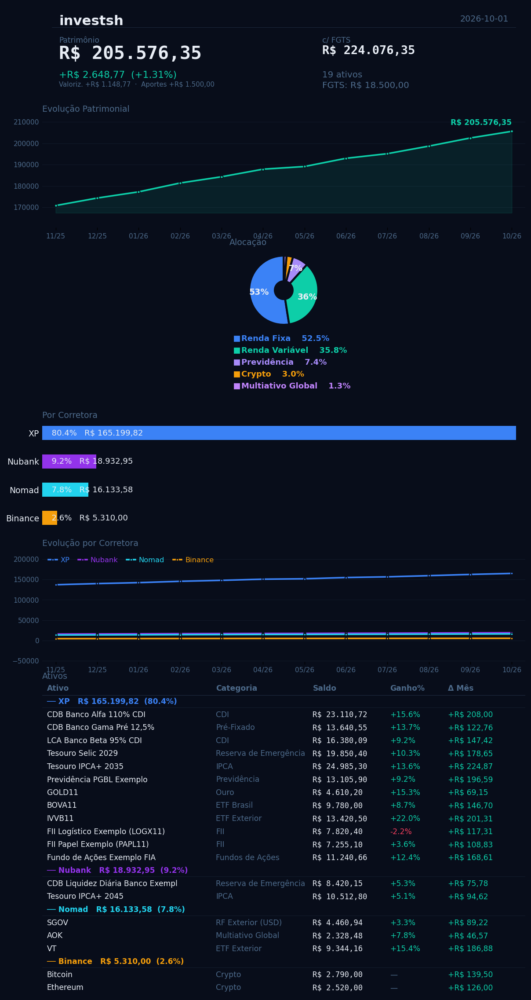

# investsh

Controle pessoal de investimentos no terminal, feito para o investidor
brasileiro. **100% local**, em Python puro: sem servidor, sem conta, sem dependências
obrigatórias. Seus dados ficam em arquivos JSON no seu computador.

- **Carteira** — patrimônio total, alocação atual vs. ideal, reserva de emergência, exposição
  por indexador e por objetivo, visão por corretora e gráficos de evolução no terminal
- **Rotina mensal** — atualize saldos, registre aportes e saques, cadastre ativos; cada save
  guarda um snapshot no histórico
- **Cotações automáticas** — dólar ([AwesomeAPI](https://docs.awesomeapi.com.br/)) e cripto
  ([CoinGecko](https://www.coingecko.com/en/api)) recalculam esses ativos ao abrir
- **Resumo em imagem** — com `matplotlib`, gera um PNG da carteira a cada save
- **Análise com IA** — gera um prompt completo da carteira para colar no Claude ou outro assistente



---

## Começo rápido

Requisito: **Python 3.9+** (macOS ou Linux; no Windows, use o WSL).

```bash
git clone https://github.com/henriqueboaventura/investsh.git
cd investsh
python3 scripts/finances.py
```

Na primeira execução o script cria `data/investments.json` e pergunta:

- **Carteira vazia** (recomendado) — para começar a cadastrar seus ativos
- **Dados de exemplo** — uma carteira fictícia, para explorar antes de usar de verdade

Depois:

1. Tecle `p` (**Parâmetros**) e ajuste FGTS, aporte mensal, premissas de projeção,
   alocação ideal e faixa da reserva de emergência.
2. Tecle `n` (**Novo ativo**) para cadastrar cada investimento.
3. Tecle `w` para salvar.

> Prefere editar JSON à mão? Copie `examples/investments.json` para `data/` e edite.
> O formato está em [docs/DATA_FORMAT.md](docs/DATA_FORMAT.md).

Opcional — para o resumo em imagem:

```bash
pip install -r requirements.txt
```

---

## Rotina mensal

```bash
python3 scripts/finances.py
```

| Tecla | Ação |
|---|---|
| `u` | Atualizar o saldo de todos os ativos, um a um (Enter mantém o valor) |
| `Enter` | Na aba Detalhe: atualizar saldo, aporte, saque ou excluir o ativo selecionado |
| `n` | Cadastrar novo ativo |
| `p` | Parâmetros |
| `/` | Buscar (aba Detalhe) |
| `s` `a` `i` `o` `d` `b` `g` | Abas: Sumário, Alocação, Indexador, Objetivo, Detalhe, Brokers, Gráficos |
| `↑` `↓` / `j` `k` | Navegar |
| `r` | Recarregar do disco |
| `w` | Salvar |
| `q` | Sair |

Ao salvar:

- `data/investments.json` é gravado e um snapshot vai para `data/history.json`
  (alimenta os gráficos de evolução);
- com `matplotlib` instalado, o resumo visual é gerado em `assets/status.png`.

Sem terminal interativo, ou para scripts: `python3 scripts/finances.py --menu` abre um menu
numerado com as mesmas funções (opção `V` mostra a carteira completa).

---

## Análise com IA

```bash
python3 scripts/analyze.py
```

Gera um prompt com toda a carteira (alocação vs. ideal, desempenho, vencimentos, parâmetros)
e copia para o clipboard (macOS). Sem clipboard, salva em `analise_prompt.txt`. Cole numa
conversa nova no [claude.ai](https://claude.ai) ou no assistente que preferir. Lembre que
isso envia os dados da sua carteira para o serviço escolhido.

---

## Privacidade

- Os scripts só leem e escrevem arquivos locais. As únicas chamadas de rede são as cotações
  (AwesomeAPI e CoinGecko), que não recebem nenhum dado seu.
- `data/`, `assets/status.png` e planilhas estão no `.gitignore`: seus
  dados **não** vão para o git por padrão.

### Versionar seus dados num repositório privado

Para ter histórico no git ou sincronizar entre computadores:

1. Use um repositório **privado** (nunca um fork público).
2. Remova `data/` e `assets/status.png` do `.gitignore`.
3. Opcional: `export FINANCES_AUTO_GIT=1` para que todo save no `finances.py` faça
   `git commit` + `git push` automaticamente.

---

## Personalização

| O quê | Onde |
|---|---|
| Alocação ideal, reserva, FGTS, projeção | Tecla `p` no `finances.py`, ou `data/investments.json` |
| Grupos de alocação | `GROUP_META` em `scripts/finances.py` |
| Corretoras, ordem e cores | `_BROKERS`, `BROKER_ORDER` e `BR_C` em `scripts/finances.py` |
| Criptos com cotação automática | `CRYPTO_IDS` (IDs do CoinGecko) em `scripts/finances.py` |

Ativos com `investedUSD` (ex.: corretora Nomad) são tratados como investimentos em dólar e
convertidos pela cotação do dia.

---

## Estrutura

```
├── scripts/
│   ├── finances.py       # Carteira: TUI (padrão) e menu texto (--menu)
│   └── analyze.py        # Gera prompt de análise para IA
├── examples/             # Dados fictícios (ponto de partida)
├── data/                 # Seus dados — criado na 1ª execução, fora do git
│   ├── investments.json  #   carteira atual
│   └── history.json      #   snapshots a cada save
└── docs/
    └── DATA_FORMAT.md    # Formato dos arquivos JSON
```

---

## Problemas comuns

**Caracteres estranhos, sem cores ou tela cortada** — use um terminal UTF‑8 com pelo menos
100 colunas, ou o modo texto: `python3 scripts/finances.py --menu`.

**`_curses` não encontrado (Windows)** — rode no WSL, ou use `--menu`.

**Cotações não atualizam** — as APIs públicas têm limite de requisições; espere um minuto e
abra de novo. Sem cotação, os saldos salvos continuam valendo.

**"pip install matplotlib → necessário para imagem"** — aviso apenas; tudo funciona sem ele,
só não gera o PNG.

---

## Aviso

Ferramenta pessoal de organização, não recomendação de investimento. Confira sempre os saldos
nos extratos oficiais.

## Licença

[MIT](LICENSE)
